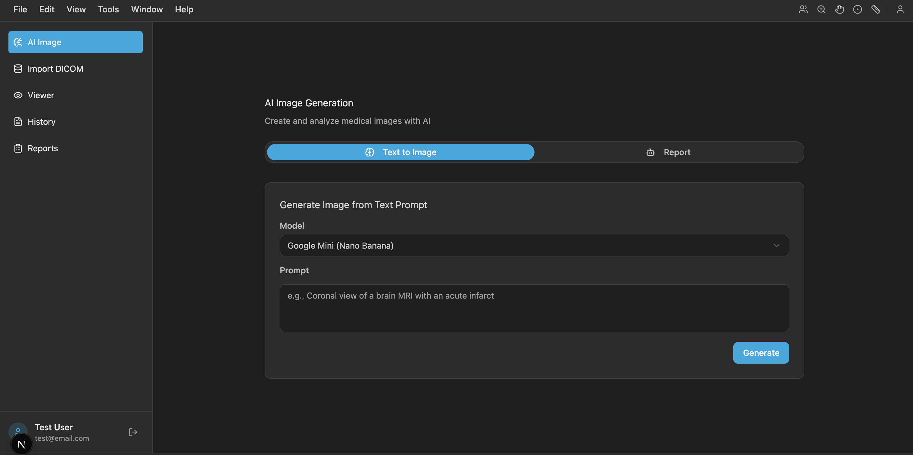

# MiGTool

A comprehensive **Medical Imaging Analysis Tool** powered by AI, built with Next.js and React. MiGTool combines advanced medical imaging capabilities with cutting-edge AI models to provide text-to-image generation, medical image translation, automated report generation, and intelligent chat assistance.



## ✨ Features

### 🖼️ AI Image Generation & Translation
- **Text-to-Image Generation**: Create medical images from text descriptions using Google's Imagen 4
- **Medical Image Translation**: Convert between different imaging modalities:
  - X-ray ↔ MRI translation using Gemini 3 Pro Image Preview
  - CT ↔ MRI translation using DeCGAN and Att-DeCGAN models
- **4 AI Models Available**:
  - Google Mini (Nano Banana) - Imagen 4 for text-to-image
  - Gemini 3 Pro (Image Preview) - X-ray ↔ MRI translation
  - DeCGAN - CT ↔ MRI translation
  - Att-DeCGAN - CT ↔ MRI translation with attention mechanism

### 📋 Automated Report Generation
- Generate detailed radiology reports from medical images
- Powered by **Gemini 2.5 Pro** for accurate medical analysis
- Markdown-formatted reports with structured sections
- Export reports as PDF or text files
- Comprehensive report history and management

### 💬 AI Chat Assistant
- Interactive chat powered by **Gemini 2.5 Pro**
- Context-aware conversations about:
  - Generated images and their properties
  - Medical reports and findings
  - Medical terminology explanations
- Persistent chat history for each image and report

### 🏥 DICOM Support
- Import and view DICOM medical images
- DICOM file parsing and metadata extraction
- Session-based import tracking
- Image viewer with medical imaging tools

### 📊 Comprehensive Dashboard
- User analytics and activity tracking
- Image generation history
- Report management system
- Search and filter capabilities

## 🛠️ Tech Stack

### Frontend
- **Next.js 16** - React framework with App Router
- **TypeScript** - Type-safe development
- **Tailwind CSS 4** - Modern utility-first styling
- **Radix UI** - Accessible, unstyled component primitives
- **React Hook Form** - Performant form management
- **Recharts** - Data visualization
- **next-themes** - Dark mode support

### Backend & Database
- **Drizzle ORM** - Type-safe database toolkit
- **SQLite** - Lightweight database with Turso/LibSQL
- **Server Actions** - Next.js server-side functions

### AI & Medical Imaging
- **Google Gemini AI** - Gemini 2.5 Pro & Gemini 3 Pro Image Preview
- **Google Imagen 4** - Advanced image generation
- **Hugging Face Gradio** - DeCGAN and Att-DeCGAN model integration
- **Cornerstone.js** - Medical imaging display and tools
- **DICOM Parser** - Medical image format support
- **dcmjs** - DICOM data manipulation

### Additional Libraries
- **Jose** - JWT authentication
- **bcryptjs** - Password hashing
- **jsPDF** - PDF generation
- **Sonner** - Toast notifications
- **Lucide React** - Icon system

## 🚀 Getting Started

### Prerequisites
- Node.js 24.x
- pnpm 10.28.2 or higher
- Google Gemini API key

### Installation

1. **Clone the repository**
   ```bash
   git clone https://github.com/nkwabyte/MigTool.git
   cd MiGTool
   ```

2. **Install dependencies**
   ```bash
   pnpm install
   ```

3. **Set up environment variables**
   
   Create a `.env` file in the root directory:
   ```env
   GOOGLE_GEMINI_API_KEY=your_gemini_api_key_here
   DATABASE_URL=file:./sqlite.db
   JWT_SECRET=your_jwt_secret_here
   ```

4. **Initialize the database**
   ```bash
   pnpm drizzle-kit generate
   pnpm drizzle-kit migrate
   ```

5. **Run the development server**
   ```bash
   pnpm dev
   ```

6. **Open your browser**
   
   Navigate to [http://localhost:3000](http://localhost:3000)

## 📦 Building for Production

```bash
# Build the production bundle
pnpm build

# Start the production server
pnpm start
```

## 🗂️ Project Structure

```
MiGTool/
├── src/
│   ├── actions/          # Server actions for API calls
│   ├── app/              # Next.js app router pages
│   ├── components/       # React components
│   │   ├── modules/      # Feature modules
│   │   └── ui/           # Reusable UI components
│   ├── db/               # Database schema and client
│   ├── lib/              # Utility functions and helpers
│   └── store/            # Redux store (legacy)
├── public/               # Static assets
├── drizzle/              # Database migrations
└── scripts/              # Build and utility scripts
```

## 🔑 Key Features Explained

### Image Translation Models
- **Gemini 3 Pro Image Preview**: State-of-the-art X-ray to MRI translation using Google's latest multimodal AI
- **DeCGAN**: Deep Convolutional GAN for CT/MRI translation via Hugging Face
- **Att-DeCGAN**: Attention-based DeCGAN for improved translation quality

### Report Generation
- Analyzes medical images using Gemini 2.5 Pro
- Generates structured reports with:
  - Patient information
  - Study details (modality, body part, date)
  - Detailed findings
  - Clinical impressions
  - Recommendations

### Chat System
- Contextual conversations about images and reports
- Explains medical terminology in layman's terms
- Maintains conversation history
- Powered by Gemini 2.5 Pro for accurate medical knowledge

## 📄 License

This project is private and proprietary.

## 🤝 Contributing

This is a private project. For collaboration inquiries, please contact the repository owner.

## 📧 Support

For issues or questions, please open an issue in the repository or contact the development team.

---

Built with ❤️ using Next.js and Google Gemini AI